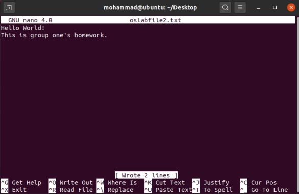
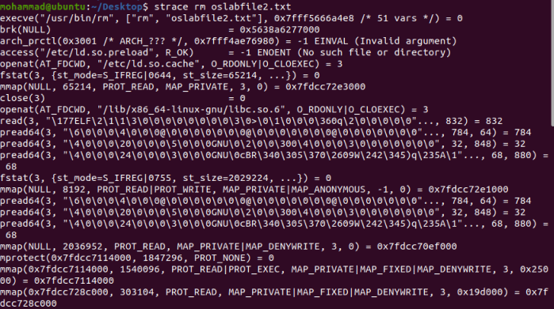
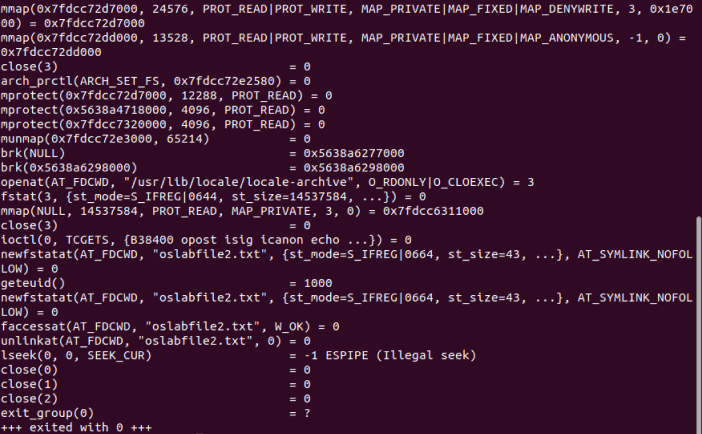
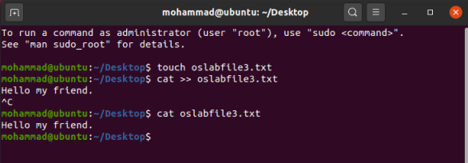
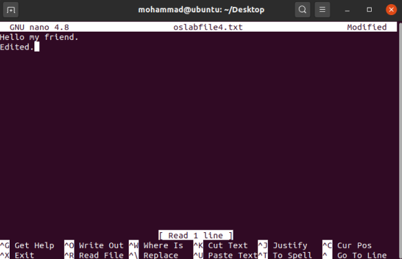
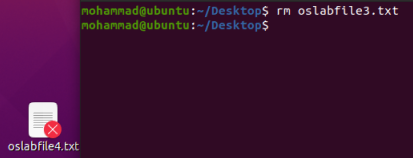
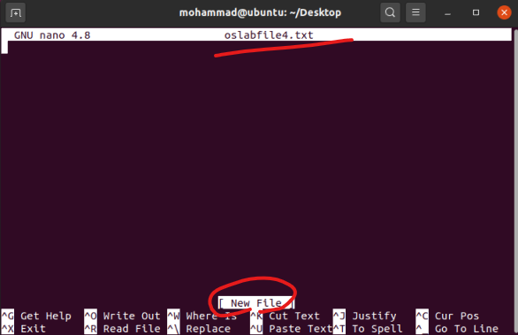

# تمرین سوم درس آزمایشگاه سیستم عامل

برای درک inode number، ابتدا باید مفهوم inode را بدانیم. در سیستم عامل، جدولی به اسم inode table وجود دارد که در آن اطلاعات(metadata) مربوط به فایل ها و فولدر ها وجود دارد. به هر یک از ورودی های این جدول، یک inode گفته میشود.
هر فایلی در سیستم یک عدد شناسه به نام inode number دارد که در سیستم یکتا است. در حقیقت یک index از جدول inode table میباشد.
برای ساخت فایل txt از دستور touch استفاده میکنیم و یک فایل به نام oslabfile1.txt میسازیم. در ادامه برای نوشتن یک متن درون فایل از دستور cat > oslabfile1.txt استفاده میکنیم و بعد از زدن کلید enter، متن خود را وارد میکنیم. در انتها با زدن کلیدهای ctrl+c از محیط ویرایش خارج میشویم. برای مشاهده محتوای فایل از cat oslabfile1.txt استفاده میکنیم (مشابه دستور قبلی ولی بدون فلش <).

برای پیدا کردن inode number فایل oslabfile1.txt، دستور ls -li oslabfile1.txt را وارد میکنیم. مشاهده میکنیم که عدد inode فایل ما 403728 میباشد.
در ادامه طبق دستورکار پیش میرویم و دستور ln oslabfile1.txt oslabfile2.txt را وارد میکنیم. مشاهده میکنیم که یک فایل دیگر به نام oslabfile2.txt در کنار فایل قبلیمان ایجاد شده است و inode number هردو کاملا یکسان است.

سوال 1) هردو 403728.

سوال 2) یکسان هستند.

سوال 3) محتوایشان کاملا یکسان است زیرا hard link هستند و هردو به یک دیتا در هارد فیزیکی اشاره میکنند.
با دستور nano oslabfile2.txt فایل oslabfile2.txt را با ادیتور nano باز میکنیم و محتوای آنرا ویرایش میکنیم. سپس با کلیدهای ctrl+o آنرا ذخیره و با ctrl+x از آن خارج میشویم.

سوال 4) بله. بعد از ویرایش هم محتوای هردو یکسان تغییر میکنند (به کمک دستور cat محتوای آنها را مشاهده کردیم).

سوال 5) با دستور rm oslabfile1.txt فایل اول را حذف میکنیم و مشاهده میکنیم که فایل oslabfile2.txt همچنان وجود دارد و حذف نشده است.

سوال 6) دستور strace rm oslabfile2.txt را وارد میکنیم.

دستور strace برای debug کردن کاربرد دارد. این دستور System Call های انجام شده برای اجرای دستورِ پس از خودش (در اینجا rm oslabfile2.txt) را نمایش میدهد (trace میکند).

سوال 7) execve، brk، arch_prctl، access و ... که در تصویر زیر میتوانید مشاهده کنید.

با دستور touch oslabfile3.txt فایل را ایجاد میکنیم و به کمک cat >> oslabfile3.txt وارد محیط append کردن میشویم و متن دلخواهمان را وارد میکنیم تا به فایل oslabfile3.txt اضافه شود. دستور ln -s oslabfile3.txt oslabfile4.txt یک soft link از فایل oslabfile3.txt به نام oslabfile4.txt ایجاد میکند.

سوال 8) inode number فایل oslabfile3.txt عدد 403712 و فایل oslabfile4.txt عدد 403621 میباشد.

سوال 9) بله، تغییر کرده است.

سوال 10) فایل oslabfile3.txt را حذف میکنیم. مشاهده میکنیم که فایل oslabfile4.txt خراب میشود و زمانی که میخواهیم آنرا با nano ویرایش کنیم، یک فایل جدید ایجاد میکند. Soft link مانند یک shortcut عمل میکند و به فایل oslabfile3.txt اشاره میکنند، نه به دیتای فیزیکی روی هارد دیسک. به همین دلیل پس از حذف oslabfile3.txt، فایل oslabfile4.txt خراب میشود و محتوایش را است دست میدهد. زیرا دیگر فایل oslabfile3.txt دیگر وجود ندارد تا به آن اشاره کند.

سوال 11) از لینک برای اشاره به فایل های دیگر استفاده میشود. لینک دارای دو نوع hard link و soft link میباشد که hard link، به دیتای ذخیره شده روی هارد فیزیکی اشاره میکند. به همین علت inode number آنها یکسان خواهد بود. ولی Soft link به یک فایل روی سیستم عامل اشاره میکند. برای مثال یک فایل جدید با inode numberـه 405821 ایجاد میشود که به فایلی دیگر با inode numberـه 406013 اشاره میکند. به همین علت زمانی که فایل 406013 پاک میشود، فایل 405821 محتوایش دیگر مشابه قبلی نخواهد بود و از بین میرود (پاک میشود).

سوال 12) لینک ها در لینوکس برای ایجاد shortcut استفاده میشود که بسته به نوع خواسته کاربر، میتواند Hard یا Soft باشد.
